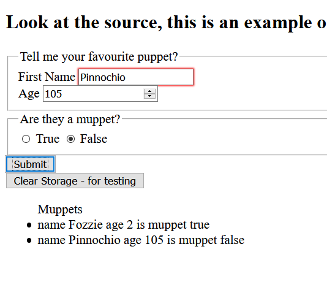

## Webstorage 

Take a copy of the html & js code from [starter](starter/)

Note, as you go along put in appropriate JSDoc comments for the functions and inline comments on the code as needed.

1. Add an unordered or ordered list to the html
1. Modify the code so that every time you add a puppet a list item is also added to the html list, with information from the object.
***test & make sure it is working before going to the next step, see the screen shot below as an example***
1. Modify the code so that every time you newly load the site it populates the list
***test & make sure it is working before going to the next step***
4. Add a dropdown field `<select>` to the form, materials (ex: cotton, silk, fake fur, wood...)
1. Add the field to the object and make sure it is saved & displayed properly ***test & make sure it is working before going to the next step***
1. Once the previous steps are working, add a button for delete & implement code to delete given the name

